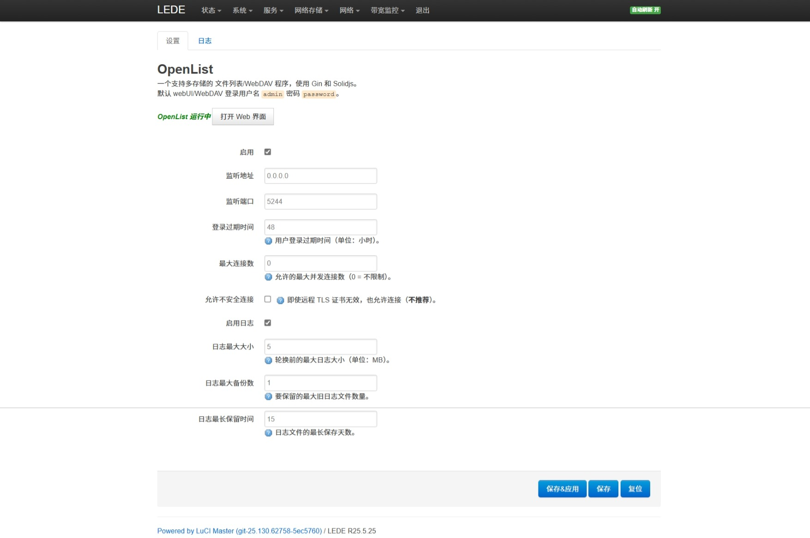

# LuCI-app-OpenList

I18N: 中文 | [English](README_EN.md) | [日本語](README_JA.md)

[
](https://github.com/Internet1235/Luci-app-OpenList/blob/main/LICENSE)
[
](https://github.com/Internet1235/luci-app-openlist/releases)

🗂️一个支持多存储的文件列表程序，使用 Gin 和 SolidJS，基于 AList 项目 fork 开发

## 如何添加到OpenWrt里?

### 1. 使用git clone克隆到OpenWrt源码里:
```bash
git clone https://github.com/Internet1235/luci-app-openlist.git package/openlist
```
- #### 在配置菜单中添加OpenList:
```bash
make menuconfig
```
#### 在``LuCI -> Applications``勾选``luci-app-openlist``,选择``Save``保存并选择``Exit``退出即可。

---

#### 为了避免和源码自带的OpenList起冲突，在``./scripts/feeds update -a``后执行下面的命令: 
```bash
rm -rf feeds/packages/net/openlist
rm -rf feeds/luci/applications/luci-app-openlist
```

-----------------------------

## ⚠️ 重要兼容性说明: 
- 当前分支仅支持LuCI2(OpenWrt21.02-24.10), 如要在LuCI(OpenWrt-18.06)上使用，请前往 ``lua`` 分支或[点击这里](https://github.com/Internet1235/luci-app-openlist/tree/lua)

## 插件使用效果


---


## Credits: 

- [OpenList](https://github.com/OpenListTeam/OpenList)
- OpenList插件: https://github.com/Internet1235/luci-app-openlist.git && https://github.com/coolsnowwolf/packages/tree/master/net/openlist
- [OpenWrt](https://github.com/openwrt/openwrt)
- [coolsnowwolf/lede](https://github.com/coolsnowwolf/lede)
- [ImmortalWrt](https://github.com/immortalwrt/immortalwrt)

