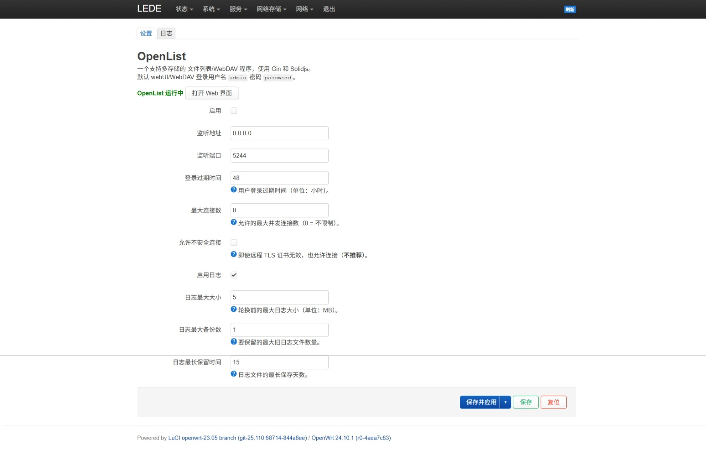
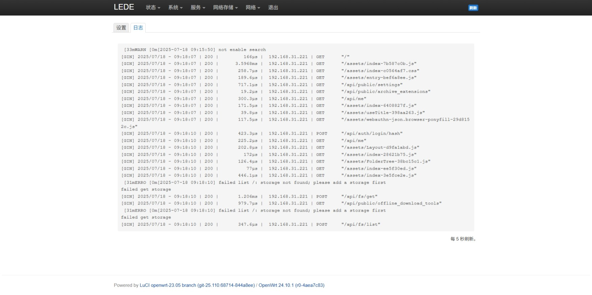

# LuCI-app-OpenList

I18N:  日本語 | [中文](README.md) | [English](README_EN.md)

[
](https://github.com/Internet1235/Luci-app-OpenList/blob/main/LICENSE)
[
](https://github.com/Internet1235/luci-app-openlist/releases)

🗂️複数のストレージをサポートするファイルリストプログラムで、Gin と SolidJS を使用し、AList プロジェクトをフォークして開発されまし

## OpenWrtへの追加方法

### 1. git cloneを使用してOpenWrtソースコードにクローンする:
```bash
git clone https://github.com/Internet1235/luci-app-openlist.git package/openlist
```
- #### 設定メニューにOpenListを追加:
```bash
make menuconfig
```
#### ``LuCI → Applications`` で ``luci-app-openlist`` にチェックを入れ、``Save`` で保存後、``Exit`` を選択して終了します。

---

#### 組み込みのOpenListとの競合を避けるため、```./scripts/feeds update -a``` を実行した後に次のコマンドを実行してください: 
```bash
rm -rf feeds/packages/net/openlist
rm -rf feeds/luci/applications/luci-app-openlist
```

-----------------------------

## ⚠️ 重要な互換性に関する注意: 
- このブランチは LuCI2 (OpenWrt 21.02 - 24.10) のみサポートしています。LuCI (OpenWrt 18.06) でご利用の場合は、``lua`` ブランチに切り替えるか、[こちらをクリック](https://github.com/Internet1235/luci-app-openlist/tree/lua)してください。

## プラグインのスクリーンショット


---



## Credits: 

- [OpenList](https://github.com/OpenListTeam/OpenList)
- OpenListプラグイン: https://github.com/Internet1235/luci-app-openlist.git && https://github.com/coolsnowwolf/packages/tree/master/net/openlist
- [OpenWrt](https://github.com/openwrt/openwrt)
- [coolsnowwolf/lede](https://github.com/coolsnowwolf/lede)
- [ImmortalWrt](https://github.com/immortalwrt/immortalwrt)

